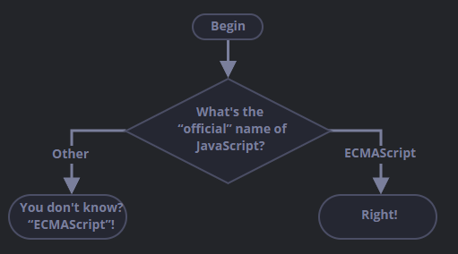

# JavaScript Fundementals

Notes, links, etc. for part 1 section 2. Getting into the language itself and syntax.

## 2.1 Hello, world

*Browsers are simple to run JS scripts, but server-side environments can execute scripts through command (e.g.* `node my.js` *for Node.js) For now, the browser will be our main way to run Javascript scripts.*

In HTML, the `<script>` tag is used to inject JavaScript code. `type` and `langauge` attributes are not required due to the modern HTML standard.

```html
<script> alert("Hello, world!"); </script>

<!-- Non-modern version -->
<script type="text/javascript"> alert("wompwomp"); </script>
```

To insert an external script, the `src` attribute is used, and can be used in different ways:

```html
<script src="/path/to/script.js"></script>

<!-- Full URL to script -->
<script src="/url/of/scripturl.js"></script>

<!-- Multiple tags for multiple scripts -->
<script src="/js/script1.js"></script>
<script src="/js/script2.js"></script>
```

If `src` is used, the inside of the `script` tag won't execute- only the external script:

```html
<script src="/js/script.js">
  alert("am i here?"); // this is ignored because of the 'src' attribute
</script>

<!-- It will work like this when split into two separate tags -->
<script src="/js/script.js>"></script>
<script>
  alert("am i here>?");
</script>
```

The main rule for scripts is to put more complex ones in separate files, very simple ones into HTML. By doing this, the browser takes advantage of caching the file and makes pages faster.

### Exercises

- Create a page that shows a message "I'm JavaScript!"
- Modify the solution above by extracting the script content into an external file `alert.js`.

### Related Files

- helloworld.html
- imjavascript.html
- imjavascript2.html
- js/helloworld.js
- js/alert.js

## 2.2 Code Structure

Building blocks of code is important.

### Statements

Statements are usually separated by a semicolon. They are usually on their own lines to enhance readability.

```js
alert("Hello"); alert("World"); // still works

alert("line 3"); // but this is more readable
alert("line 4");
```

### Semicolons

Semicolons can be omitted for linebreaks, usually. There are some exceptions:

```js
alert("line") // this works
alert("break")

alert("but not this") // but not this
[1, 2].forEach(alert);
```

In the example above (and many absent examples), the engine sees it as:

```js
alert("but not this")[1, 2].forEach(alert);
```

This is because JavaScript does not assume a semicolon before square brackets.

In other words, always use semicolons regardless.

### Comments

These are used to describe what code does and why, or it can be used to temporarily disable parts of code. JavaScript uses `//` for one-line comments and `/* ... */` for multiline comments.

```js
// One-liner

/* Multiliner

Anything in here will be a comment
efefefef

this is disabled
alert("hello");
*/
alert("world"); // but not this
```

Nested comments do not work:

```js
/*
  /* nested comment ?!? */
*/
alert("World");
```

### Related Files

- js/structure.js

## 2.3 The Modern Mode, "use strict"

Before 2009, JavaScript was able to grow with new features without destroying old ones. But that made any imperfect feature stuck in the language forever.

In 2009, ECMAScript 5 (ES5) was released which added new features and modified some of the existing ones. They are enabled using `use strict` at the top of JS scripts:

```js
"use strict";

// this code works the modern way
...
```

### Related Files

- js/usestrict.js

## 2.4 Variables

Variables is a "named storage" for data. We use `let` to declare variables in JavaScript:

```js
let message; // declare it

message = "Hello!"; // then assign it data
```

There are multiple ways to declare variables:

```js
let message = "Hello!"; // declare and assign at the same time

let user = "John", age = 25; // multiple variables in one line

let user2 = "Mary",
  age2 = 25; // this works

let user3 = "Doe"
  , age3 = 25; // and this too
```

You can also declare variables using `var` instead of `let`, but it's the old version. There are subtle differences between them.

Only declare variables once, not twice. Otherwise, it is an error:

```js
let message = "This";

let message = "That"; // SyntaxError: 'message' has already been declared
```

### Variable Naming

Limitations

- The name can only have letters, digits, `$`, or `_`.
- The first character cannot be a digit.

```js
let userName;
let test123;
let $ = 1;
let _ = 2; // these work

let 3four;
let hello-world; // but these don't
```

Cases also matter. `apple` is different from `APPLE`.

There are also reserved names; these are used as keywords in JavaScript. Some examples include `let`, `class`, `return`, and `function`.

```js
let let = 5; // error
```

Without `use strict`, variables can be declared without `let` or `var`. But with it, it would be an error.

```js
"use strict";

num = 5; // error: num is not defined
```

### Constants

Using `const` instead of `let` makes the variable unchangeable:

```js
const myBirthday = "18.04.1982";
```

Trying to change a `const` variable will cause an error. Programmers use it to tell that it is a variable that will never change.

### Naming Practices

Some rules to follow are:

- Use human-readable names like `userName` or `shoppingCart`.
- Limit use of abbreviatios or short names like `a` or `b` unless it's simple.
- Make names descriptive and concise.
- Make related variables name-related like `newUser` and `currentUser`.

### Exercises

*(Note: these are verbatim from the website)*

#### Working with Variables

- Declare two variables: `admin` and `name`.
- Assign the value `"John"` to `name`.
- Copy the value from `name` to `admin`.
- Show the value of `admin` using `alert` (which should output "John").

#### Giving the right name

- Create a variable with the name of our planet. How would you ame such a variable?
- Create a variable to store the name of a current visitor to a website. How would you name that variables?

**Uppercase const?**

Look at this code:

```js
const birthday = '18.04.1982';

const age = someCode(birthday);
```

Here we have a constant `birthday` for the date, and also the `age` constant.

The `age` is calculated from `birthday` using `someCode()`, which means a function call that we didn’t explain yet (we will soon!), but the details don’t matter here, the point is that `age` is calculated somehow based on the `birthday`.

Would it be right to use upper case for `birthday`? For `age`? Or even for both?

```js
const BIRTHDAY = '18.04.1982'; // make birthday uppercase?

const AGE = someCode(BIRTHDAY); // make age uppercase?
solution
```

### Related Files

- js/variables.js

## 2.5 Data Types

JavaScript has eight basic data types:

- `number`
- `bigint`
- `string`
- `boolean`
- `null`
- `undefined`
- `symbol`
- `object`

JavaScript is *dynamically typed*, meaning its variables are not bound by a specific data type (use TypeScript for that).

```js
let message = "hello";
message = 123456; // was a string, now a number
```

### Number

The `number` type include integer and floating point numbers.

```js
let n = 123;
n = 12.345;
```

Numbers can perform math operations like `*`, `/`, `+`, and `-`.

There are also special `number` values: `Infinity`, `-Infinity`, and `NaN`.

We can get `Infinity` through division by zero or directly:

```js
alert( 1 / 0 ); // Infinity

alert( Infinity ); // Infinity
```

`NaN` represents a computational error, as a result of an incorrect or an undefined math operation. It is also sticky (any futher math operation on `NaN` returns `NaN`):

```js
alert ( "not a number" / 2 ); // NaN
alert ( NaN + 1 ); // NaN
alert ( 3 * NaN ); // NaN
alert ( "not a number" / 2 - 1 ) // NaN
```

Only exception is `NaN ** 0 = 1`. Regardless, any math is "safe" in JavaScript. The worst the script can result in is `NaN`.

### BigInt

The `number` type cannot represent integers larger than `(2^53-1)`, or less than `-(2^53)`
for negatives.

So, `BigInt` is used to represent these larger numbers, by appending `n` at the end:

```js
const bigInt = 123456789012345678901234567890123456789012345678901234567890n;
```

`BigInt` are seldom used, like in cryptography or microsecond-precision timestamps.

### String

JavaScript strings is surrounded by quotes, either: double quotes, single quotes, or backticks:

```js
let str1 = "Hello";
let str2 = 'World';
let str3 = `I wanted to say ${str1} ${str2}!`;
```

Double quotes and single quotes behave the same, but backticks allow for `${...}` to be used to embed variables/expressions.

### Boolean (logical type)

Booleans can either be `true` or `false`. They can also come as a result of comparisons:

```js
let isCurrentUser = true;
let isOlderThan67 = false;

let isGreater = 6 > 7;
alert ( isGreater ); // false
```

### "null" value

`null` is a special value that does not belong to any of the types above. It essentially means "nothing", "empty" or "value unknown".

Below means `age` is unknown:

```js
let age = null;
```

### "undefined" value

The `undefined` type is similar to `null`, but it means that a "value is not assigned", not nothing/unknown.

```js

let age;
alert(age); // shows "undefined"

age = 100;
alert(age); // age = 100

age = undefined;
alert(age); // shows "undefined" again
```

`undefined` can be assigned but not recommended. `null` is normally used to show empty values, while `undefined` is for default initial values for unassigned things.

### Objects and Symbols

The `object` is different from the other "primitive" types because they contain only a single value. `object` types can contain multiple values.

The `symbol` type is use to create unique identifiers for objects.

### typeof Operator

The `typeof` operator returns the type of the operand, useful for processing values of different types differently or just want to check it.

```js
typeof undefined // "undefined"

typeof 0 // "number"

typeof 10n // "bigint"

typeof true // "boolean"

typeof "foo" // "string"

typeof Symbol("id") // "symbol"

typeof Math // "object": Math is a built-in object for more math operations

typeof null // "object": this was an error back then and kept for compatibility; it is clearly not an "object"

typeof alert // "function": alert is a function
```

`typeof` can also be written as `typeof(x)`. It is an operator, not a function.

### Exercises

**String quotes**

*(Note: these are verbatim from the website)*

What is the output of the script?

```js
let name = "Ilya";

alert( `hello ${1}` ); // ?

alert( `hello ${"name"}` ); // ?

alert( `hello ${name}` ); // ?
```

### Related Files

- js/datatypes.js
- datatypes.html

## 2.6 Interaction: alert, prompt, confirm

Some functions for user interaction include `alert`, `prompt`, and `confirm`.

### alert

This function (as seen earlier) shows a message and waits for the user to press "OK".

```js
alert("Hello");
```

The small window is called a *modal* window, meaning the user can't interact with the rest of the page, press other buttons, etc., until they have dealt with the window.

### prompt

The function `prompt` accepts two arguments: `title` as text to show the user, and `default` as the initial value for the input field.

```js
result = prompt(title, [default]);
```

A modal window pops up with a text message, an input field, and buttons OK/Cancel. If the user presses OK, `result` will get it. Otherwise, the user can press Cancel or hit the `esc` key to get `null` as the result.

It is recommended to always set a default value.

### confirm

The function `confirm` shows a modal window with a question and two buttons: OK and Cancel. If OK is pressed, then the result is `true` and `false` otherwise.

```js
let result = confirm(question);

let isBoss = confirm("Are you the boss?");

alert ( isBoss ) // true if OK is pressed;
```

### Exercises

*(Note: these are verbatim from the website)*

#### A Simple Page

- Create a web-page that asks for a name and outputs it.

### Related Files

- interactions.html
- js/prompt.js

## 2.7 Type Conversions

Usually, operators and functions automatically convert values to the right type, e.g. `alert` already converts any value to a string to show it.

### String Conversion

This occurs when we output something, done with `String(value)`.

```js
let value = false;
alert (typeof value); // boolean

value = String(value);
alert (typeof value); // string
```

### Numeric Conversion

This occurs in math operations, done with `Number(value)`. The rules are:

- if `undefined`, then `Number(undefined)` becomes `NaN`.
- if `null`, then `Number(null)` becomes `0`.
- if `true/false`, then `Number(true)` becomes `1` and `Number(false)` becomes `0`.
- if `string`, then it is read "as is" and whitespace from both sides are ignored. An empty string becomes `0`, and an error gives `NaN`.

```js
alert( "6" / "2" ); // 3, strings are converted to numbers

let str = "123";
alert(typeof str); // string

let num = Number(str); // becomes a number 123
alert(typeof num); // num
```

### Boolean Conversion

This occurs in logical operations, done with `Boolean(value)`. The rules are:

- if `0`, `null`, `undefined`, `NaN`, or `""`, then `Boolean(...)` becomes `false`.
- if it is any other value, then `Boolean(...)` becomes `true`.

```js
alert( Boolean("0") ); // true
alert( Boolean(" ") ); // also true
```

## 2.8 Basic Operators, Maths

There are the simple math operations like addition and multiplication, but JavaScript also includes more specific operations.

### Unary, Binary, Operand

*Operand* - what we apply operators to. `5 * 2` has a left operand `5` and a right operand `2`. They can also be called "arguments".

*Unary* - an operator with a single operand.

```js
let x = 1;

x = -x; // -1, unary negation was applied
```

*Binary* - an operator with two operands.

```js
let x = 1, y = 3;
alert( y - x ); // 2
```

### Maths

The supported math operations are:

- Addition `+`,
- Subtraction `-`,
- Multiplication `*`,
- Division `/`,
- Remainder `%`,
- Exponentiation `**`.

#### Remainder %

This operator is the *remainder* of the integer division of `a` by `b`. It is not related to percents.

```js
alert( 5 % 2 ); // 1
alert( 8 % 3 ); // 2
alert( 8 % 4 ); // 0
```

#### Exponentiation **

This operator raises `a` to the power of `b`.

```js
alert( 2 ** 2 ) // 2**2 = 4
alert( 2 ** 3 ) // 2**3 = 8
alert( 4 ** (1/2) ) // 2
alert( 8 ** (1/3) ) // 2
```

### String Concatenation w/Binary +

When `+` is used on strings, it merges them:

```js
let s = "my" + "string";
alert(s); // mystring
```

It will convert non-strings to strings if one of the operands is a string. If there's more than two operands, it will add them from left to right:

```js
alert( '1' + 2 ); // "12"
alert ('1' + 2 + 2 ) // "122" and not "14"
```

It is *not* the same with subtraction and division:

```js
alert( 6 - '2' ); // 4
alert ( '6' / '2' ); // 3
```

### Numeric Conversion, Unary +

When `+` is applied to a single value, it does nothing to numbers. However, it will convert non-numbers to numbers.

```js
let x = 1;
alert( +x ); // 1

let y = -2;
alert( +y ); // -2

alert( +true ); // 1
alert( +"" ); // 0
```

Sometimes, we'll have to convert strings to numbers before "operating" them, e.g. HTML form fields as strings.

```js
let apples = "2";
let oranges = "3";

alert( apples + oranges ); // "23"

alert( +apples + +oranges ); // 5
// this also works: alert( Number(apples) + Numbers(oranges) ); // 5
```

### Operator Precedence

"PEMDAS" applies here, but it's also important to note that unary operators have higher precedence (than binary operators) and assignment has lower precedence (than binary operators).

### Assignment

Assignment `=` is also an operator.

```js
let x = 2 * 2 + 1;
alert( x ); // 5
```

It also returns a value: `x = value` writes the `value` into `x` then returns it. It is not recommended to write like this:

```js
let a = 1;
let b = 2;

let c = 3 - (a = b + 1);

alert( a ); // 3
alert( c ); // 0
```

#### Chaining Assignments

Assignments can be chained where it is evaluated from right to left:

```js
let a, b, c;

a = b = c = 2 + 2;

alert( a ); // 4
alert( b ); // 4
alert( c ); // 4
```

But due to readability, it's better to split it:

```js
c = 2 + 2;
b = c;
a = c;
```

### Modify-in-place

We can modify the same variable with `+=`, `-=`, etc. for all arithmetical and bitwise operators.

```js
let n = 2;
n += 5; // n = 7
n *= 2; // n = 14

alert( n ); // 14

n * = 1 + 2; // 1 + 2 = 3 * n = 42
```

### Increment/decrement

There are special operators for incrementing and decrementing (variables only):

```js
let counter = 2;

counter++; // adds 1 to counter
alert( counter ); // 3

counter--; // subtracts 1 to counter
alert( counter ); // 2
```

`++` and `--` can be placed before or after a variable.

- `counter++` means it is in "postfix form"
- `++counter` means it is in "prefix form"

The difference is noticed when we use the returned value:

```js
let counter = 1;
let a = ++counter; // a = 2; 'counter' is incremented, then 'a' is assigned the value of 'counter'

counter = 1;
a = counter++; // a = 1; value of 'a' is 'counter', then we increment 'counter'
```

Its precedence is higher than most operations.

### Bitwise Operators

There are bitwise operators that work on the level of numbers' binary representation, not specific to JavaScript:

- AND ( `&` )
- OR ( `|` )
- XOR ( `^` )
- NOT ( `~` )
- LEFT SHIFT ( `<<` )
- RIGHT SHIFT ( `>>` )
- ZERO-FILL RIGHT SHIFT ( `>>>` )

### Comma

This is one of the rarest operators. It is used to evaluate several expressions, but only the result of the last one is returned.

```js
let a = (1 + 2, 3 + 4);

alert( a ); // 7 (the result of 3 + 4)
```

Here is a good example:

```js
for (a = 1, b = 3, c = a * b; a < 10; a++) {
  ...
}
```

Above, the first two expressions won't be used anyways outside of the comma, but it is still used within for `c`.

### Exercises

#### The postfix and prefix forms

What are the final values of all variables `a`, `b`, `c`, and `d` after code below?

```js
let a = 1, b = 1;

let c = ++a; // ?
let d = b++; // ?
```

#### Assignment Result

What are the values `a` and `x` after code below?

```js
let a = 2;

let x = 1 + (a *= 2);
```

#### Type Conversions

What are results of these expressions?

```js
"" + 1 + 0
"" - 1 + 0
true + false
6 / "3"
"2" * "3"
4 + 5 + "px"
"$" + 4 + 5
"4" - 2
"4px" - 2
"  -9  " + 5
"  -9  " - 5
null + 1
undefined + 1
" \t \n" - 2
```

#### Fix the Addition

Here’s a code that asks the user for two numbers and shows their sum.

It works incorrectly. The output in the example below is 12 (for default prompt values).

Why? Fix it. The result should be 3.

```js
let a = prompt("First number?", 1);
let b = prompt("Second number?", 2);

alert(a + b); // 12
```

### Related Files

- js/mathops.js

## 2.9 Comparisons

There are math comparison operators available in JavaScript:

- Greater/less than: `a > b`, `a < b`.
- Greater/less than or equals: `a >= b`, `a <= b`.
- Equals: `a == b` (note two `=`'s).
- Not equals: `a != b`.

### Boolean is the Result

All comparison operators return a boolean value, which can also be stored:

- `true` - means "yes", "correct" or "the truth".
- `false` - means "no", "wrong" or "not the truth".

```js
alert( 2 > 1 ); // true (correct)
alert( 2 == 1 ); // false (wrong)
alert( 2 != 1 ); // true (correct)

let result = 5 > 4;
alert( result ); // true
```

### String Comparison

Strings are compared letter-by-letter, lexicographically.

```js
alert( 'Z' > 'A' ); // true
alert( 'Glow' > 'Glee' ); // true
alert( 'Bee' > 'Be' ); // true
```

For two strings `A` and `B`:

1. Compare the first character of `A` and `B`.
2. If the `A`'s first character is `>`/`<` than `B`'s, then `A` is `>`/`<` than `B`.
3. Otherwise, they are the same, so we compare the next.
4. Repeat until the end of either string.
5. If both strings end at the same length, then they are equal. Otherwise, the longer string is greater.

### Comparison of Different Types

JavaScript converts values to numbers for different types:

```js
alert( "2" > 1 ); // true, '2' becomes 2
alert( "01" == 1 ); // true, '01' becomes 1

alert ( true == 1 ); // true
alert ( false == 0 ); // true
```

It is possible to have two equal values but they have different boolean values,
which is due to different `Boolean` conversion rules:

```js
let a = 0;
alert( Boolean(a) ); // false

let b = "0";
alert( Boolean(b) ); // true

alert(a == b); // true
```

### Strict Equality

`===` is used for strict equality **without type conversion**, because `==` will do that first before checking:

```js
alert( 0 == false ); // true
alert( '' == false ); // true

alert( 0 === false ); // false, because types are different
```

Strict non-equality is `!==`.

### Comparison w/null and undefined

With `null` or `undefined`, it's different behavior.

```js
alert( null === undefined ); // false, because different types

alert( null == undefined ); // true, because special rule
```

Here's `null` compared with zero:

```js
alert( null > 0 ); // (1) false
alert( null == 0 ); // (2) false
alert( null >= 0 ); // (3) true
```

Comparisons e.g `>=/>` will convert `null` to 0, whereas `==` will not. That's why (3) is `true` but (2) is not.

Here is `undefined` compared with zero:

```js
alert( undefined > 0 ); // (1) false
alert( undefined < 0 ); // (2) false
alert( undefined == 0 ); // (3) false
```

(1) and (2) convert `undefined` to `NaN`, which returns false for all comparisons. (3) only equals `null`, `undefined`, and no other value.

If a variable may be `null/undefined`, it is better to check for them separately instead of using comparisons.

### Exercises

#### Comparisons

What will be the result for these expressions?

```js
5 > 4
"apple" > "pineapple"
"2" > "12"
undefined == null
undefined === null
null == "\n0\n"
null === +"\n0\n"
```

### Related Files

- js/comparisons.js

## 2.10 Conditional Branching: if, '?'

### The "if" Statement

`if(...)` evaluates the condition in parentheses and executes the code block if `true`.

```js
if (year == 2015) alert( "You are right!" ); // Basic syntax

if (year == 2015) { // Allows >1 statements + more readable
  alert( "That's so correct!" );
  alert( "You're so smart!" );
}
```

### Boolean Conversion

The `if` statement will convert its expression into a boolean result.

```js
if (0) { ... } // 0 is falsy; will always fail

if (1) { ... } // 1 is truthy; will always pass

let cond = (year == 2015);
if (cond) { ... }; // can pass a pre-evaluated boolean as well
```

### The "else" Clause

An `if` statement can have an optional `else` block which executes when the condition is falsy.

```js
let a = 10, b = 0;

if (b > a) { // 0 > 10 ?
  ...
} else { // triggers
  ...
}
```

### Several Conditions: "else if"

A `if` statement can have multiple conditions to check, using `else if`:

```js
let a = 10, b = 0, c = -55;

if (a > 99) {
  alert( "Wrong!" );
} else if (a > b) {
  alert( "Right!" );
} else {
  alert( "idk bro" );
}
```

### Conditional Operator '?'

There is a simpler way to assign a variable based on a yes/no condition, using `?`. It is also called a *ternary* since the expressions takes three operands. Here is the formula:

```js
let result = condition ? value1 : value2;
```

```js
let accessAllowed;
let age = 19;

// 'if' method
if (age > 18) {
  accessAllowed = true;
} else {
  accessAllowed = false;
}

alert(accessAllowed);

// ternary method
accessAllowed = age > 18 ? true : false;
```

`?` has lower precedence, so we can omit the parentheses (if we want).

### Multiple '?'

Multiple `?`'s can be used, similar to multiple `else if` statements:

```js
let age = prompt('age?', 18);

let message = (age < 3) ? 'Hi, baby!' :
  (age < 18) ? 'Hello!' :
  (age < 100) ? 'Greetings!' :
  'What an unusual age!';

alert( message );
```

### Non-traditional Use of '?'

Sometimes, `?` can be used to replace `if`:

```js
let company = prompt('Which company created JavaScript?', '');

(company == 'Netscape') ?
   alert('Right!') : alert('Wrong.');
```

Instead of assigning a value to a variable, we execute a statement based on the condition. However, it is not recommended to do it like this.

### Exercises

#### if (a string with zero)

Will `alert` be shown?

```js
if ("0") {
  alert( 'Hello' );
}
```

#### The name of JavaScript

Using the `if..else` construct, write the code which asks: "What is the *official* name of JavaScript?"

If the visitor enters *ECMAScript*, then output "Right!", otherwise - output: "You don't know? ECMAScript!"



#### Show the Sign

Using `if..else`, write the code which gets a number via `prompt` and then shows in `alert`:

- `1`, if the value is greater than zero,
- `-1`, if less than zero,
- `0`, if equals zero.

In this task we assume that the input is always a number.

#### Rewrite 'if' into '?'

Rewrite this `if` using the conditional operator `'?'`:

```js
let result;

if (a + b < 4) {
  result = 'Below';
} else {
  result = 'Over';
}
```

#### Rewrite 'if..else' into '?'

Rewrite `if..else` using multiple ternary operators `'?'`.

For readability, it’s recommended to split the code into multiple lines.

```js
let message;

if (login == 'Employee') {
  message = 'Hello';
} else if (login == 'Director') {
  message = 'Greetings';
} else if (login == '') {
  message = 'No login';
} else {
  message = '';
}
```

### Related Files

- js/conditionals.js
- conditionals.html

## 2.11 Logical Operators

JavaScript has four logical operators: `||` (OR), `&&` (AND), `!` (NOT), `??` (Nullish Coalescing).

### || (OR)


### Exercises


### Related Files


## 2.12 Nullish Coalescing Operator '??'
