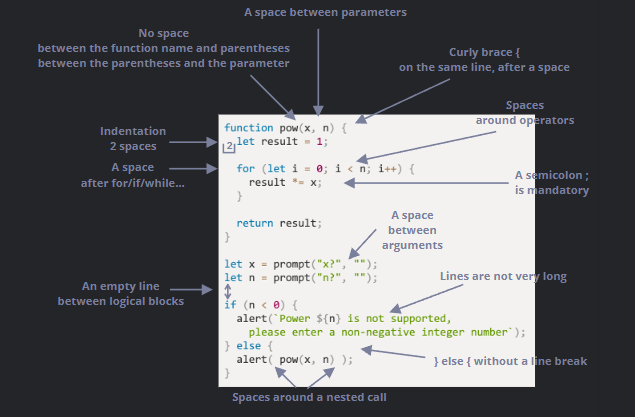

# Code Quality

Notes, links, etc. for part 1 section 3. General, good coding practices.

## 3.1 Debugging in the Browser

It is important to know how to debug to fix code, and we can do that e.g. in the browser.

We can pause the script by:

1. A breakpoint.
2. The `debugger` statements.
3. An error (if dev tools are open and it is paused).

Pausing allows us to examine variables and trace the code to see where execution went wrong.

## 3.2 Coding Style

Code must be clean and readable, and coding styles allows us to do that. Here is a cheat sheet:



These are suggested, not set-in-stone.

In JavaScript, curly braces are in "Egyptian" style. Line lengths are 80-120 characters.
Horizontal indents are 2 or 4 spaces. Vertical spaces split the code reasonably.
Semicolons should be presented after each statement. Nesting levels should not be too deep;
one-liners and checks are good ways to reduce nesting. Functions should be placed above or below
the main code.

There are style guides by different companies like Google, and there are also linters to automate
styling.

### Exercises

#### Bad style

What's wrong with the code style below?

```js
function pow(x,n)
{
  let result=1;
  for(let i=0;i<n;i++) {result*=x;}
  return result;
}

let x=prompt("x?",''), n=prompt("n?",'')
if (n<=0)
{
  alert(`Power ${n} is not supported, please enter an integer number greater than zero`);
}
else
{
  alert(pow(x,n))
}
```

Fix it.

### Related Files

- js/style.js

## 3.3 Comments

Comments are important for non-simple code.

Developers should comment:

- Overall architecture, high-level view.
- Function usage.
- Important solutions, especially when not immediately obvious.

But, they should not comment:

- "How code works" and "what it does".
- Detail for already simple, self-telling code.

There are also auto-documenting tools to generate code, such as JSDoc3.

## 3.4 Ninja Code

Depending on how you code, you'll either have terrible tendencies or the best readable code ever.

One-liners can be cool. One-letter variables and abbreviations are ways to shorten code.
Abstract words work too. Having similar but important names for variables is impactful.

In seriousness, make your code as simple but readable as possible.

## 3.5 Automated Testing with Mocha

Testing is important to make sure the code works as intended. Manual testing is exhausting,
while automated testing ensures every piece of code works (or most if you're lazy).

Behavior Driven Development (BDD) is a well-known technique. In BDD, it's *tests* AND *documentation* AND *examples*.

The development flow is like this:

1. An initial spec is written, with tests for the most basica functionality.
2. An initial implementation is created.
3. Check that it works using a testing framework (like Mocha) that runs the spec. While the functionality is not complete,
errors are displayed. We make corrections until everything works.
4. Now we have a working initial implementation with tests.
5. We add more use cases to the spec, probably not yet supported by the implementations.
Tests start to fail.
6. Go to 3, update the implementation till tests give no errors.
7. Repeat steps 3-6 till the funcionality is ready.

i.e. Write tests first, then match implementation to pass tests, then write more tests, then update
code to pass new tests, etc.

Here is a page utilizing the testing framework, Mocha:

```html
<!DOCTYPE html>
<html>
<head>
  <!-- add mocha css, to show results -->
  <link rel="stylesheet" href="https://cdnjs.cloudflare.com/ajax/libs/mocha/3.2.0/mocha.css">
  <!-- add mocha framework code -->
  <script src="https://cdnjs.cloudflare.com/ajax/libs/mocha/3.2.0/mocha.js"></script>
  <script>
    mocha.setup('bdd'); // minimal setup
  </script>
  <!-- add chai -->
  <script src="https://cdnjs.cloudflare.com/ajax/libs/chai/3.5.0/chai.js"></script>
  <script>
    // chai has a lot of stuff, let's make assert global
    let assert = chai.assert;
  </script>
</head>

<body>

  <script>
    function pow(x, n) {
      /* function code is to be written, empty now */
    }
  </script>

  <!-- the script with tests (describe, it...) -->
  <script src="test.js"></script>

  <!-- the element with id="mocha" will contain test results -->
  <div id="mocha"></div>

  <!-- run tests! -->
  <script>
    mocha.run();
  </script>
</body>

</html>
```

### Exercises

#### What's wrong in the test?

What's wrong in the test of `pow` below?

```js
it("Raises x to the power n", function() {
  let x = 5;

  let result = x;
  assert.equal(pow(x, 1), result);

  result *= x;
  assert.equal(pow(x, 2), result);

  result *= x;
  assert.equal(pow(x, 3), result);
});
```

P.S. Syntactically the test is correct and passes.

### Related Files

- js/testing.js

## 3.6 Polyfills and Transpilers

Transpilers translate source code to another source code. It rewrites modern code to older syntax constructs
to have it work on older engines.

Polyfills are scripts that updates/adds new functions because older engines do not have some of the new functions.
